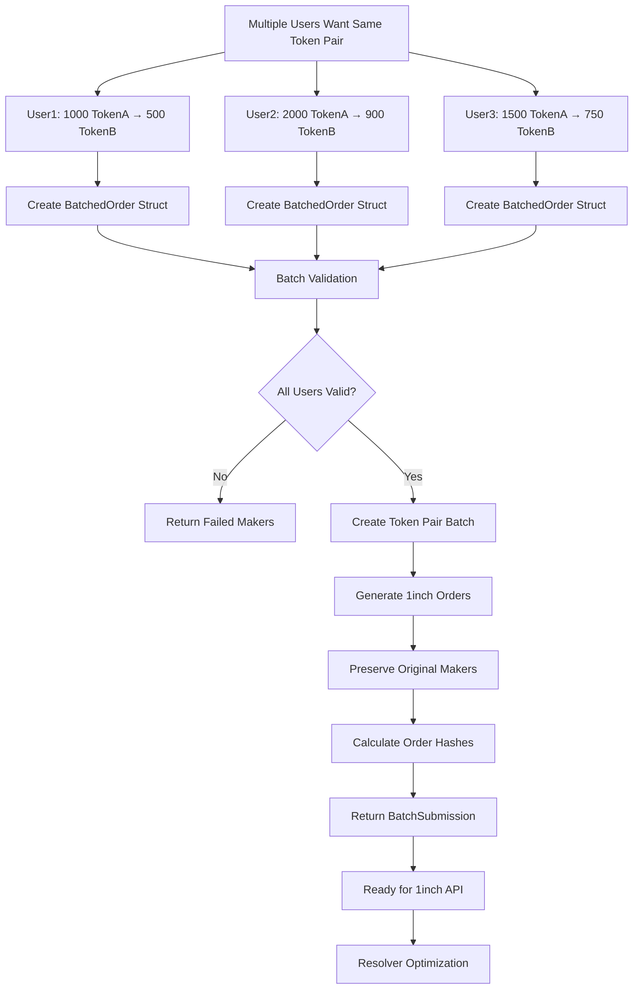
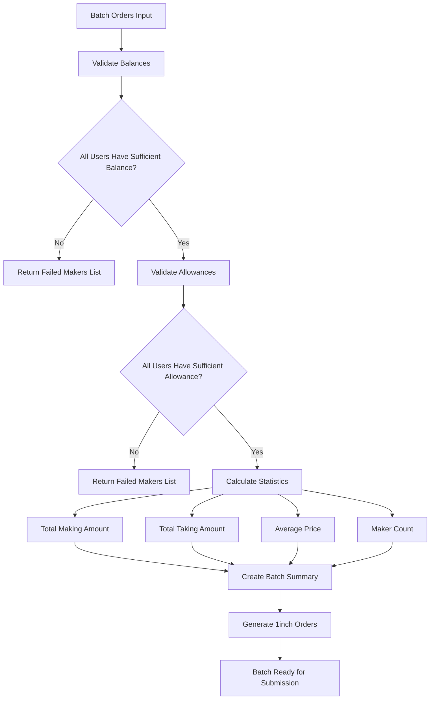
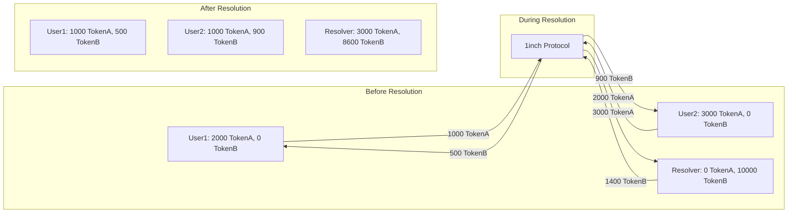

# MultiBatch1inchHelper Implementation Documentation

## 📋 Table of Contents
1. [Contract Functions](#contract-functions)
2. [Test Suite Explanation](#test-suite-explanation)
3. [Flow Charts](#flow-charts)
4. [Integration Guide](#integration-guide)

## 🔧 Contract Functions

### Core Data Structures

#### `ApprovalData`
```solidity
struct ApprovalData {
    address token;    // Token address to approve
    uint256 amount;   // Amount to approve
}
```
Used for batch token approvals.

#### `BatchedOrder`
```solidity
struct BatchedOrder {
    address maker;        // Original user who created the order
    uint256 makingAmount; // Amount of maker asset to sell
    uint256 takingAmount; // Amount of taker asset to receive
    uint256 salt;         // Unique identifier for the order
}
```
Represents an individual user's order within a batch.

#### `TokenPairBatch`
```solidity
struct TokenPairBatch {
    address makerAsset;         // Token being sold
    address takerAsset;         // Token being bought
    BatchedOrder[] orders;      // All orders in the batch
    uint256 totalMakingAmount;  // Total amount being sold
    uint256 totalTakingAmount;  // Total amount being bought
}
```
Summary of a complete batch for a token pair.

#### `BatchSubmission`
```solidity
struct BatchSubmission {
    IOrderMixin.Order[] orders;  // 1inch-compatible orders
    bytes32[] orderHashes;       // Unique hashes for each order
    address[] makers;            // Original makers for each order
    uint256 totalOrders;         // Number of orders in batch
}
```
Final submission ready for 1inch resolver processing.

### 🔄 Approval Functions

#### `batchApprove(ApprovalData[] calldata approvals)`
**Purpose**: Approve multiple tokens with specific amounts in a single transaction.

**Parameters**:
- `approvals`: Array of token addresses and amounts to approve

**Flow**:
1. Iterates through each approval in the array
2. Calls `IERC20.approve()` for each token
3. Emits `BatchApprovalCompleted` event

**Use Case**: When users need to approve multiple tokens before creating orders.

#### `batchApproveUnlimited(address[] calldata tokens)`
**Purpose**: Set unlimited approval for multiple tokens.

**Parameters**:
- `tokens`: Array of token addresses

**Flow**:
1. Iterates through each token
2. Approves `type(uint256).max` for each token
3. Emits `BatchApprovalCompleted` event

**Use Case**: One-time setup for frequent traders.

### 📊 Batch Creation Functions

#### `createTokenPairBatch(address makerAsset, address takerAsset, BatchedOrder[] calldata batchedOrders, address receiver)`
**Purpose**: Create a complete batch submission for multiple users trading the same token pair.

**Parameters**:
- `makerAsset`: Token being sold (e.g., TokenA)
- `takerAsset`: Token being bought (e.g., TokenB)
- `batchedOrders`: Array of orders from different users
- `receiver`: Address to receive tokens (0 = send to maker)

**Returns**: `BatchSubmission` ready for 1inch processing

**Flow**:
1. Creates arrays for orders, hashes, and makers
2. For each batched order:
   - Converts to 1inch `Order` format
   - Preserves original maker address
   - Generates unique order hash
3. Returns complete submission

**Key Feature**: Maintains individual user ownership while organizing for batch processing.

#### `createTokenPairSummary(address makerAsset, address takerAsset, BatchedOrder[] calldata batchedOrders)`
**Purpose**: Generate summary statistics for a token pair batch.

**Returns**: `TokenPairBatch` with aggregated data

**Flow**:
1. Sets token pair addresses
2. Copies order array
3. Calculates total making and taking amounts
4. Returns summary structure

### ✅ Validation Functions

#### `validateBatchBalances(address makerAsset, BatchedOrder[] calldata batchedOrders)`
**Purpose**: Verify all users have sufficient token balances.

**Returns**:
- `valid`: True if all users have sufficient balance
- `failedMakers`: Array of addresses with insufficient balance

**Flow**:
1. Creates temporary array for failed makers
2. For each order:
   - Checks maker's token balance
   - Adds to failed array if insufficient
3. Returns validation result and failed addresses

**Critical**: Prevents failed transactions due to insufficient funds.

#### `validateBatchAllowances(address makerAsset, BatchedOrder[] calldata batchedOrders)`
**Purpose**: Verify all users have approved sufficient tokens.

**Returns**:
- `valid`: True if all users have sufficient allowance
- `failedMakers`: Array of addresses with insufficient allowance

**Flow**:
1. Creates temporary array for failed makers
2. For each order:
   - Checks maker's token allowance to protocol
   - Adds to failed array if insufficient
3. Returns validation result and failed addresses

**Critical**: Ensures smooth order execution.

### 📈 Analytics Functions

#### `getBatchStatistics(BatchedOrder[] calldata batchedOrders)`
**Purpose**: Calculate comprehensive batch statistics.

**Returns**:
- `totalMakers`: Number of unique makers
- `totalMakingAmount`: Total amount being sold
- `totalTakingAmount`: Total amount being bought
- `avgPrice`: Average price (takingAmount/makingAmount * 1e18)

**Flow**:
1. Counts total makers (assumes unique)
2. Sums all making and taking amounts
3. Calculates average price with 18 decimal precision

**Use Case**: Analytics for batch optimization and reporting.

#### `batchCheckAllowances(address[] calldata makers, address[] calldata tokens)`
**Purpose**: Check allowances for multiple makers across multiple tokens.

**Returns**: 2D array of allowances `[maker][token]`

**Flow**:
1. Creates 2D array structure
2. For each maker:
   - For each token:
     - Queries allowance to protocol
     - Stores in 2D array
3. Returns complete allowance matrix

**Use Case**: Dashboard views for multiple users and tokens.

### 🚨 Emergency Functions

#### `emergencyWithdrawToken(address token, uint256 amount)`
**Purpose**: Recover accidentally sent tokens.

**Note**: In production, should include proper access control.

## 🧪 Test Suite Explanation

### Core Functionality Tests (`MultiBatch1inchHelper.t.sol`)

#### `testBatchApprove()`
**Purpose**: Verify batch approval functionality works correctly.

**Test Flow**:
1. **Setup**: Create approval data for 2 tokens
2. **Action**: Call `batchApprove()`
3. **Verification**:
   - Check event emission
   - Verify allowances are set correctly
   - Use `assertGe()` to handle existing approvals

**Key Assertion**: `assertGe(tokenA.allowance(user1, protocol), expectedAmount)`

#### `testBatchCheckAllowances()`
**Purpose**: Verify multi-dimensional allowance checking.

**Test Flow**:
1. **Setup**: Set specific allowances for multiple tokens
2. **Action**: Call `batchCheckAllowances()`
3. **Verification**: Check returned 2D array matches expected values

**Key Feature**: Tests matrix-style allowance queries.

#### `testBatchStatistics()`
**Purpose**: Verify statistical calculations are accurate.

**Test Flow**:
1. **Setup**: Create orders with known amounts
2. **Action**: Call `getBatchStatistics()`
3. **Verification**:
   - Total makers count
   - Sum of making amounts
   - Sum of taking amounts
   - Average price calculation

**Key Calculation**: Average price = `(totalTaking * 1e18) / totalMaking`

#### `testBatchValidation()`
**Purpose**: Test comprehensive validation of balances and allowances.

**Test Flow**:
1. **Setup**: Create orders within user limits
2. **Positive Test**: All validations should pass
3. **Negative Test**: Create order exceeding balance
4. **Verification**:
   - Valid scenarios return `true`
   - Invalid scenarios return `false` with failed addresses

**Key Feature**: Tests both success and failure scenarios.

#### `testMultiUserTokenPairBatch()`
**Purpose**: Test the core multi-user batching functionality.

**Test Flow**:
1. **Setup**: Create orders from 3 different users for same token pair
2. **Action**: Call `createTokenPairBatch()`
3. **Verification**:
   - Correct number of orders created
   - Original makers preserved
   - Unique order hashes generated
   - Proper amount allocation

**Key Verification**: Each user maintains ownership of their order.

#### `testTokenPairSummary()`
**Purpose**: Test batch summary generation.

**Test Flow**:
1. **Setup**: Create batch with known totals
2. **Action**: Call `createTokenPairSummary()`
3. **Verification**: Summary totals match input data

#### `testCompleteMultiUserWorkflow()`
**Purpose**: End-to-end integration test.

**Test Flow**:
1. **Create**: Multi-user orders
2. **Validate**: Balances and allowances
3. **Generate**: Batch submission
4. **Analyze**: Statistics
5. **Verify**: All steps work together

### Resolver Workflow Tests (`SimpleResolverTest.t.sol`)

#### `testMakerArgumentExplanation()`
**Purpose**: Educational test explaining the maker concept.

**Test Output**:
```
=== MAKER ARGUMENT EXPLANATION ===
In 1inch limit orders, 'maker' = the ORIGINAL USER who created the order
- Order 1: maker = user1 (0x1001)
- Order 2: maker = user2 (0x1002)
IMPORTANT: Even in batches, each order keeps its original maker!
```

#### `testBatchHelperPreservesOriginalMakers()`
**Purpose**: Verify maker preservation through the entire pipeline.

**Test Flow**:
1. **Input**: Orders with specific makers
2. **Process**: Through batch creation
3. **Verify**: Makers preserved at every level:
   - Input orders
   - Batch submission
   - 1inch order format

#### `testResolverFulfillmentAndRedistribution()`
**Purpose**: Complete simulation of resolver workflow with actual token transfers.

**Test Flow**:
1. **Setup**: Users with TokenA, Resolver with TokenB
2. **Create**: Batch orders
3. **Before**: Record all balances
4. **Execute**: Resolver fulfills orders via mock protocol
5. **After**: Verify redistribution:
   - Users get exactly what they ordered
   - Resolver accumulates all sold tokens
   - Token conservation maintained

**Key Verification**: Actual token transfers match expected amounts.

## 📊 Flow Charts

### Multi-User Batch Creation Flow



### Resolver Fulfillment Flow

```mermaid
sequenceDiagram
    participant U1 as User1
    participant U2 as User2
    participant R as Resolver
    participant P as 1inch Protocol
    participant TA as TokenA
    participant TB as TokenB

    Note over U1,U2: Users create orders for TokenA → TokenB
    U1->>P: Create Order: 1000 TokenA → 500 TokenB
    U2->>P: Create Order: 2000 TokenA → 900 TokenB

    Note over R: Resolver sees batch opportunity
    R->>P: Fill User1's Order (provide 500 TokenB)
    P->>TA: Transfer 1000 TokenA from User1 to Resolver
    P->>TB: Transfer 500 TokenB from Resolver to User1

    R->>P: Fill User2's Order (provide 900 TokenB)
    P->>TA: Transfer 2000 TokenA from User2 to Resolver
    P->>TB: Transfer 900 TokenB from Resolver to User2

    Note over U1,U2,R: Final State
    Note over U1: User1: Lost 1000 TokenA, Gained 500 TokenB
    Note over U2: User2: Lost 2000 TokenA, Gained 900 TokenB
    Note over R: Resolver: Lost 1400 TokenB, Gained 3000 TokenA
```

### Validation Flow



### Token Flow During Resolution



## 🚀 Integration Guide

### Step 1: Deploy Contract
```solidity
MultiBatch1inchHelper batchHelper = new MultiBatch1inchHelper(
    0x111111125421cA6dc452d289314280a0f8842A65  // 1inch Protocol
);
```

### Step 2: User Approvals
```solidity
// Each user approves their tokens
tokenA.approve(limitOrderProtocol, amount);

// Or use batch approval
ApprovalData[] memory approvals = new ApprovalData[](1);
approvals[0] = ApprovalData(tokenA, amount);
batchHelper.batchApprove(approvals);
```

### Step 3: Create Batch
```solidity
// Collect orders from multiple users
BatchedOrder[] memory orders = new BatchedOrder[](2);
orders[0] = BatchedOrder(user1, 1000e18, 500e6, salt1);
orders[1] = BatchedOrder(user2, 2000e18, 900e6, salt2);

// Validate batch
(bool valid, address[] memory failed) =
    batchHelper.validateBatchBalances(tokenA, orders);

// Create submission
BatchSubmission memory submission = batchHelper.createTokenPairBatch(
    tokenA, tokenB, orders, address(0)
);
```

### Step 4: Submit to 1inch
```javascript
// Off-chain: Submit to 1inch API
const orders = submission.orders.map((order, i) => ({
    order: order,
    signature: signatures[i]  // EIP-712 signatures
}));

await fetch('https://api.1inch.dev/orderbook/v4.0/1/orders/batch', {
    method: 'POST',
    body: JSON.stringify({ orders })
});
```

This implementation provides a complete, tested solution for multi-user batch limit orders with full resolver integration capabilities! 🎉